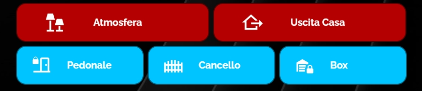
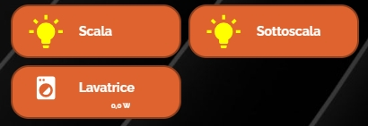
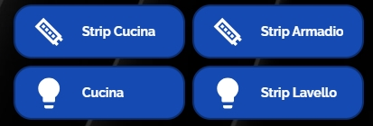
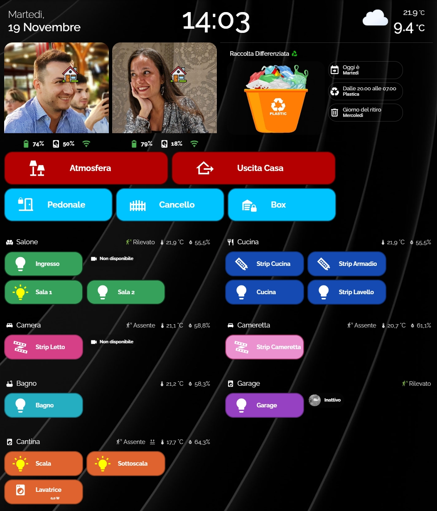

<h2><strong>🎛️ Simple Botton for home assistant</strong></h2>

è un semplice bottone che si può personalizzare: colore sfondo, bordo, modificare dimensioni, icone in base accensione e spegnimento luci (per esempio) e molto altro.

Volevo condividere questi pulsanti che ho creato con l'aiuto delle varie community.

Istruzioni:

da Hacs, installare:
1. button-card

poi ...
1. in HA create una card manuale e incollate il contenuto del file: botton-card1.txt o botton-card2.txt
2. all'interno del codice della card dovete andare a sostituire le entità con le vostre e nel caso i parametri di colore misure icone ecc.

Alla fine ci troveremo ad avere i pulsanti come in questa foto:

Enjoy!

---

## ☕ Vuoi darmi una mano?

Il contenuto di questa pagina è completamente gratuito e lo scopo non è certamente fare soldi. Se vuoi darmi una mano per le spese e il tempo perso, ecco alcuni modi:

| | |
|---|---|
|  | Offrimi un caffè su Ko-fi |
|  | Una donazione libera su PayPal |
|  | Fai i tuoi acquisti Amazon partendo da questo link |

**Canali Telegram:**

| | |
|---|---|
|  | Notizie dedicate a Home Assistant |
|  | Offerte sui prodotti di domotica |

---

Sviluppato e curato da [Simonz82](https://t.me/Simonz82) · © 2026
